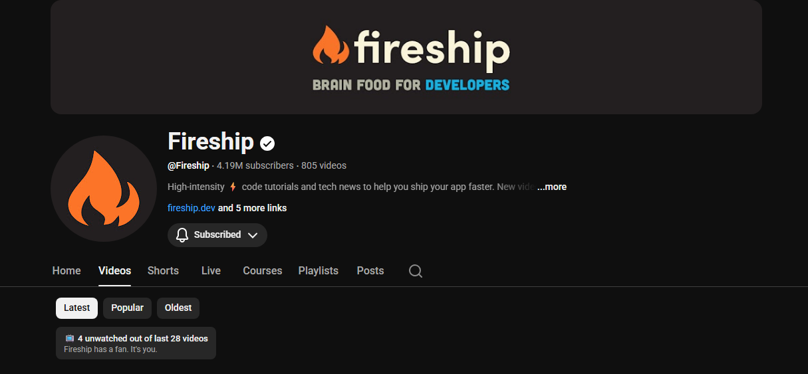

#  Channel Debt

A Chrome extension that shows how many videos you're behind on for any YouTube channel.

## What it does

When you visit a YouTube channel's videos page (e.g. `youtube.com/@Fireship/videos`), it adds a small badge showing how many videos you haven't watched — plus a comment about your commitment level.

## Install

1. Go to `chrome://extensions`
2. Enable **Developer mode**
3. Click **Load unpacked** and select this folder

## Notes

- Only works on `/@channel/videos` pages
- "Watched" is based on YouTube's own resume playback indicator, so it only counts videos you've actually played
- Works with client-side navigation (no page reload needed when switching channels)